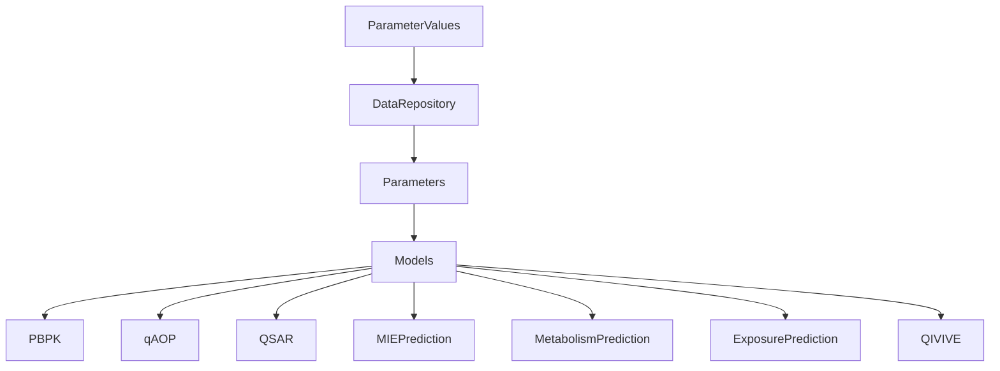

```mermaid
graph TD
  ParameterValues-->DataRepository
  DataRepository-->Parameters
  Parameters-->Models
  Models-->PBPK
  Models-->qAOP
  Models-->QSAR
  Models-->MIEPrediction
  Models-->MetabolismPrediction
  Models-->ExposurePrediction
  Models-->QIVIVE
```
